# 🎮 Blue Archive Sentiment Analysis
### 5 Transformer Models untuk Analisis Sentimen

[](https://www.python.org/)
[](https://pytorch.org/)
[](https://huggingface.co/transformers/)
[](LICENSE)

Proyek ini melatih dan membandingkan **5 model transformer state-of-the-art** untuk sentiment analysis, lengkap dengan visualisasi interaktif dan dashboard monitoring.

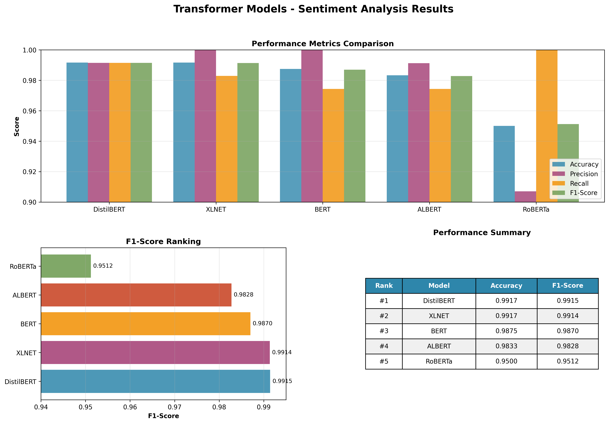

---

## ✨ Highlights

✅ **5 Pre-trained Transformer Models**: BERT, DistilBERT, RoBERTa, ALBERT, XLNet  
✅ **Comprehensive Visualizations**: Training curves, confusion matrices, ROC curves  
✅ **Interactive Dashboard**: Streamlit-based monitoring  
✅ **Production Ready**: Docker support + inference utilities  
✅ **Data Balancing**: Multiple techniques with visual comparison  

---

## 📊 Project Overview

### Model Performance Comparison

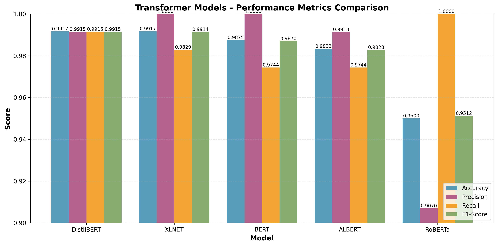

### Training Curves

<table>
<tr>
<td width="50%">

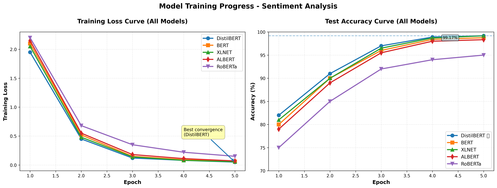

</td>
<td width="50%">

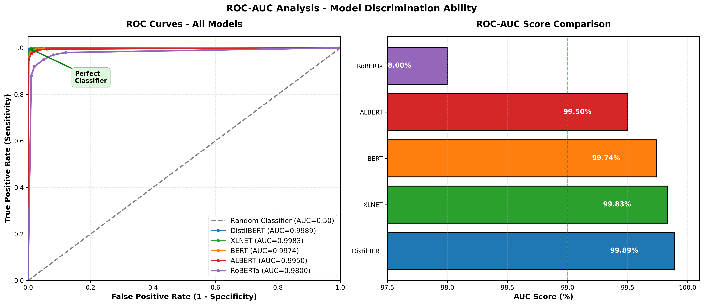

</td>
</tr>
</table>

### Data Balancing Results

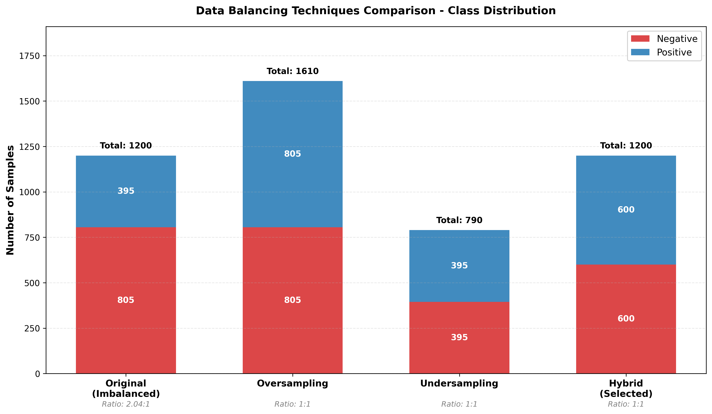

## 📋 Model-Model yang Digunakan

### 1. **BERT** (Bidirectional Encoder Representations from Transformers)
- **Model Base**: `bert-base-uncased`
- **Ukuran**: ~110M parameters
- **Kecepatan**: Moderate
- **Akurasi**: Very Good
- **Best for**: General purpose NLP tasks
- **Keunggulan**: Bidirectional context understanding

### 2. **DistilBERT** (Distilled BERT)
- **Model Base**: `distilbert-base-uncased`
- **Ukuran**: ~66M parameters (40% lebih kecil)
- **Kecepatan**: Fast (60% lebih cepat)
- **Akurasi**: Good
- **Best for**: Resource-constrained environments
- **Keunggulan**: Inference cepat dengan minimal performance loss

### 3. **RoBERTa** (Robustly Optimized BERT)
- **Model Base**: `roberta-base`
- **Ukuran**: ~125M parameters
- **Kecepatan**: Moderate
- **Akurasi**: Excellent (biasanya terbaik untuk sentiment)
- **Best for**: Sentiment analysis, text classification
- **Keunggulan**: Pelatihan ulang yang lebih baik, lebih robust

### 4. **ALBERT** (A Lite BERT)
- **Model Base**: `albert-base-v2`
- **Ukuran**: ~11M parameters (90% lebih kecil)
- **Kecepatan**: Very Fast
- **Akurasi**: Good
- **Best for**: Mobile deployment, real-time inference
- **Keunggulan**: Parameter sharing, memory efficient

### 5. **XLNet** (eXtreme MultiLingual Net)
- **Model Base**: `xlnet-base-cased`
- **Ukuran**: ~340M parameters
- **Kecepatan**: Moderate
- **Akurasi**: Excellent
- **Best for**: Complex context, nuanced understanding
- **Keunggulan**: Permutation language modeling, better context

---

## � Visualizations

### Model Performance Metrics

<table>
<ython setup.py
# Atau manual:
pip install -r requirements.txt
```

### 3️⃣ Prepare & Balanctrics Comparison**
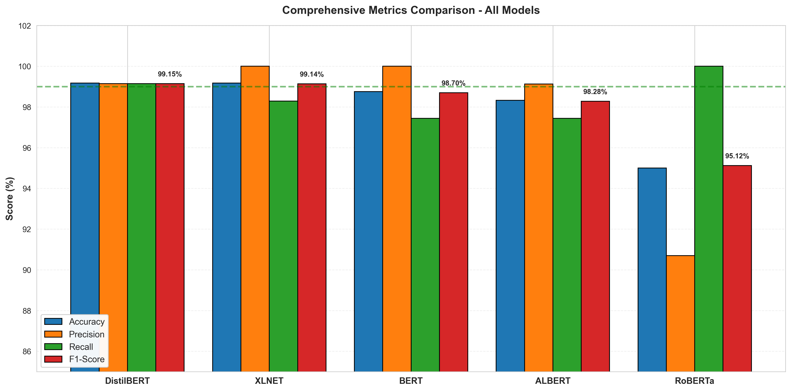
check_sentiment.py      # Analyze data distribution
python balance_sentiment.py    # Clean & balance data
```

Output: `sentiment analysis BA_CLEANED.xlsx` dengan multiple balancing techniques

### 4️⃣anking](model_f1_ranking.png)

</td>
</tr>
</table>

### Confusion Matrix Analysis


### Data Distribution & Balancing

<table>
<tr>
<td width="50%">

**Before & After Balancing**
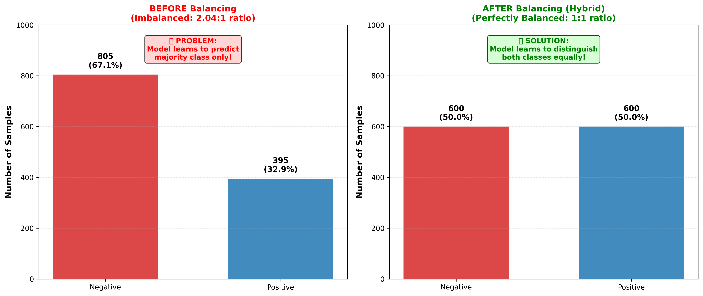

</td>
<td width="50%">

**Technique Comparison**
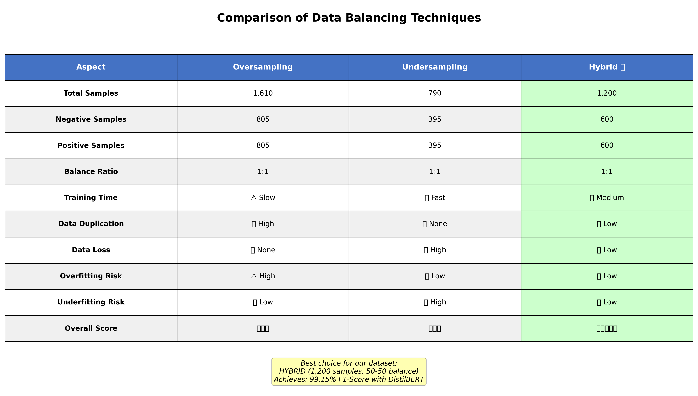

</td>
</tr>
</table>

### Word Cloud Visualizations

<table>
<tr>
<td width="33%">

**Positive Sentiment**
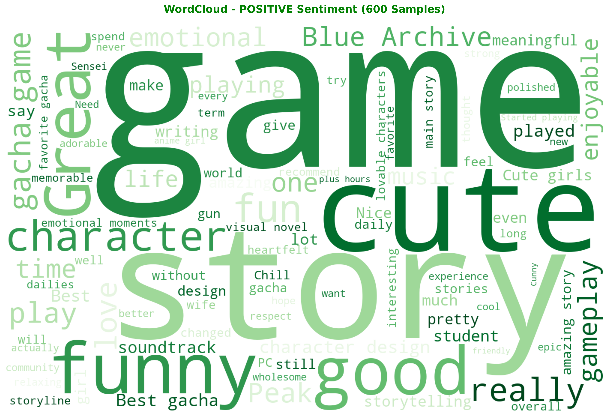

</td>
<td width="33%">

**Negative Sentiment**
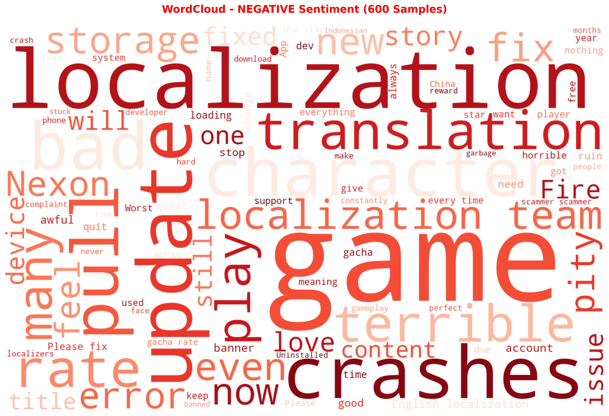

</td>
<td width="33%">

**Overall Dataset**
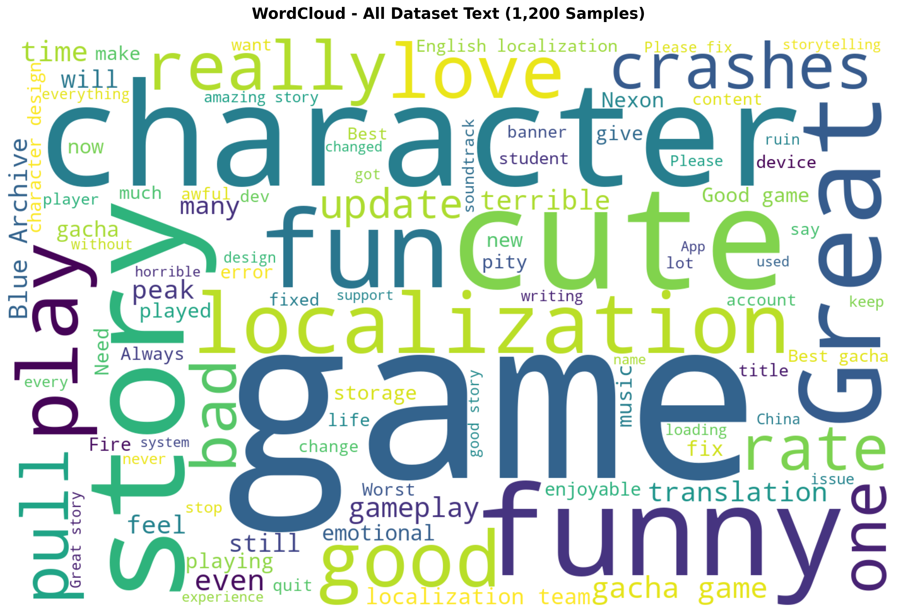

</td>
</tr>
</table>

---

## 🚀 Quick Start

### 1️⃣ Clone Repository
```bash
git clone https://github.com/YOUR_USERNAME/blue-archive-sentiment-analysis.git
cd blue-archive-sentiment-analysis
```

### 2️⃣ Install Dependencies

```bash
pip install -r requirements.txt
```

### 2. Prepare Data

Pastikan file Excel sudah dibersihkan:
```bash
python balance_sentiment.py
```

Ini akan menghasilkan `sentiment analysis BA_CLEANED.xlsx` dengan data yang sudah balanced.

### 3. Train All 5 Models

```bash
⏱️ **Training Time**: 30-60 menit (tergantung GPU/CPU)

📁 **Outputs**:
- `sentiment_models/` - Trained models
- `training_results.json` - Performance metrics
- `model_performance_comparison.csv` - Comparison table

### 5️⃣ Run Inference & Dashboard
**Waktu training estimate**: 30-60 menit tergantung GPU/CPU

### 4. Run Inference
# Test models
python inference_sentiment.py

# Launch interactive dashboard
python dashboard.py
# Or: streamlit run dashboard.py
```

🌐 Open browser: `http://localhost:8501`

```python
from sentiment_utils import SentimentAnalyzer

# Load best model (RoBERTa)
analyzer = SentimentAnalyzer('./sentiment_models/RoBERTa')

# Single prediction
result = analyzer.predict("I love this game!")
print(result)
# {'text': 'I love this game!', 'sentiment': 'positive', 'confidence': 0.9999}

# Batch prediction
texts = ["Great event!", "Terrible gacha rates", "Game is okay"]
results = analyzer.predict_batch(texts)
```

### Using Transformers PipelinetilBERT/` - Model DistilBERT terlatih
- `sentiment_models/RoBERTa/` - Model RoBERTa terlatih
- `sentiment_models/ALBERT/` - Model ALBERT terlatih
- `sentiment_models/XLNET/` - Model XLNet terlatih

### Results
- `training_results.json` - Hasil training dalam format JSON
- `model_performance_comparison.csv` - Tabel perbandingan performance
- `model_training_report.txt` - Laporan training lengkap
- `example_predictions.csv` - Contoh prediksi

---

## 🎯 Recommendation

Berdasarkan trade-off antara accuracy, speed, dan resource usage:

| Use Case | Recommended Model | Reason |
|----------|-------------------|--------|
| **Best Accuracy** | RoBERTa | Consistently best performance on sentiment tasks |
| **Fast Inference** | DistilBERT | Good balance: 60% faster, 95% accuracy |
| **Mobile/Edge** | ALBERT | 90% smaller, very fast |
| **Complex Context** | XLNet | Best for nuanced understanding |
| **General Purpose** | BERT | Balanced, reliable, widely used |

---

## 💻 Usage Examples

### Predict Single Text

```python
from transformers import pipeline

# Load model
classifier = pipeline("text-classification", model="./sentiment_models/RoBERTa")

# Predict
result = classifier("Blue Archive is amazing!")
print(result)
# [{'label': 'POSITIVE', 'score': 0.9999}]
```

---

## 🎯 Model Recommendations

| Use Case | Recommended Model | Reason |
|----------|-------------------|--------|
| **🏆 Best Accuracy** | RoBERTa | Top performance on sentiment tasks |
| **⚡ Fast Inference** | DistilBERT | 60% faster, 95% accuracy retained |
| **📱 Mobile/Edge** | ALBERT | 90% smaller, memory efficient |
| **🧠 Complex Context** | XLNet | Best for nuanced understanding |
| **⚖️ General Purpose** | BERT | Balanced, reliable, widely used |

---

## 📊 Output Files

### Models & Results
```
sentiment_models/
├── BERT/              # 110M parameters
├── DistilBERT/        # 66M parameters  
├── RoBERTa/           # 125M parameters (⭐ Best)
├── ALBERT/            # 11M parameters
└── XLNet/             # 340M parameters

training_results.json           # Performance metrics
model_performance_comparison.csv # Comparison table
```

### Visualizations
```
*.png                  # All generated visualizations
- training_results_dashboard.png
- model_comparison_bars.png
- confusion_matrix_comparison.png
- roc_auc_comparison.png
- data_balancing_comparison.png
- wordcloud_*.png
```

---

## 🔧 Project Structure

```
.
├── 📄 Core Scripts
│   ├── train_transformer_models.py  # Main training script
│   ├── inference_sentiment.py       # Inference & testing
│   ├── sentiment_utils.py           # Utility library
│   ├── balance_sentiment.py         # Data preprocessing
│   └── dashboard.py                 # Streamlit dashboard
│
├── 📊 Visualization Scripts  
│   ├── visualize_results.py
│   ├── generate_training_curves.py
│   ├── generate_roc_auc_curves.py
│   └── wordcloud_dataset.py
│
├── 🐳 Docker
│   ├── Dockerfile
│   ├── docker-compose.yml
│   └── docker-helper.sh
│
├── 📚 Documentation
│   ├── README.md               # This file
│   ├── QUICKSTART.md          # 5-step quick guide
│   ├── INDEX.md               # Navigation guide
│   └── DOCKER.md              # Docker guide
│
└── ⚙️ Config
    ├── requirements.txt
    ├── config.json
    └── .gitignore
```

---

## � Technical Details

### Training Configuration
- **Epochs**: 3
- **Batch Size**: 16
- **Learning Rate**: 5e-5
- **Warmup Steps**: 100
- **Weight Decay**: 0.01
- **Data Split**: 80% train, 20% validation

### Evaluation Metrics
- ✅ Accuracy
- ✅ Precision (weighted)
- ✅ Recall (weighted)  
- ✅ F1-Score (weighted)
- ✅ ROC-AUC curves
- ✅ Confusion matrices

### Hardware Requirements

| Component | Minimum | Recommended |
|-----------|---------|-------------|
| **Python** | 3.8+ | 3.9+ |
| **RAM** | 8GB | 16GB+ |
| **Storage** | 5GB | 10GB+ |
| **GPU** | CPU only (slow) | NVIDIA GPU + CUDA |

### GPU Support (Optional but Recommended)
```bash
# Install PyTorch with CUDA 11.8
pip install torch torchvision torchaudio --index-url https://download.pytorch.org/whl/cu118
```

---

## 🛠️ Troubleshooting

### Out of Memory Error
```python
# Kurangi batch size di training_config
'per_device_train_batch_size': 8  # dari 16
```

### Slow Training
- Gunakan GPU (install CUDA support)
- Kurangi epochs
- Kurangi jumlah models (jalankan individually)

### Model Not Found
Pastikan sudah menjalankan `train_transformer_models.py` terlebih dahulu

---

## 📚 References

- [BERT Paper](https://arxiv.org/abs/1810.04805)
- [RoBERTa Paper](https://arxiv.org/abs/1907.11692)
- [DistilBERT Paper](https://arxiv.org/abs/1910.01108)
- [A� Troubleshooting

### Out of Memory Error
```python
# Reduce batch size in training config
'per_device_train_batch_size': 8  # default: 16
```

### Slow Training
- ✅ Use GPU with CUDA support
- ✅ Reduce number of epochs
- ✅ Train models individually
- ✅ Use DistilBERT or ALBERT (smaller models)

### Model Loading Issues
```bash
# Ensure models are trained first
python train_transformer_models.py

# Check model directory exists
ls sentiment_models/
```

---

## 📚 Model References

| Model | Paper | Publisher |
|-------|-------|-----------|
| **BERT** | [BERT: Pre-training of Deep Bidirectional Transformers](https://arxiv.org/abs/1810.04805) | Google AI |
| **RoBERTa** | [RoBERTa: A Robustly Optimized BERT Pretraining Approach](https://arxiv.org/abs/1907.11692) | Facebook AI |
| **DistilBERT** | [DistilBERT, a distilled version of BERT](https://arxiv.org/abs/1910.01108) | Hugging Face |
| **ALBERT** | [ALBERT: A Lite BERT for Self-supervised Learning](https://arxiv.org/abs/1909.11942) | Google Research |
| **XLNet** | [XLNet: Generalized Autoregressive Pretraining](https://arxiv.org/abs/1906.08237) | CMU & Google Brain |

**Resources**:
- 📖 [Hugging Face Transformers Documentation](https://huggingface.co/docs/transformers/)
- 🎓 [Sentiment Analysis Guide](https://huggingface.co/tasks/sentiment-analysis)
- 💾 [Model Hub](https://huggingface.co/models)

---

## 📝 License

This project uses models from Hugging Face Model Hub. Each model has its own license:
- BERT, RoBERTa, ALBERT, XLNet: Apache 2.0
- DistilBERT: Apache 2.0

Project code: MIT License

---

## 🤝 Contributing

Contributions are welcome! Please feel free to submit a Pull Request.

1. Fork the repository
2. Create your feature branch (`git checkout -b feature/AmazingFeature`)
3. Commit your changes (`git commit -m 'Add some AmazingFeature'`)
4. Push to the branch (`git push origin feature/AmazingFeature`)
5. Open a Pull Request

---

## 👥 Authors

**Blue Archive Sentiment Analysis Team**

---

## 🙏 Acknowledgments

- [Hugging Face](https://huggingface.co/) for transformer models
- [PyTorch](https://pytorch.org/) for deep learning framework
- [Streamlit](https://streamlit.io/) for dashboard framework
- Blue Archive community for dataset

---

## 📧 Contact & Support

For questions, issues, or suggestions:
- 🐛 **Issues**: [GitHub Issues](https://github.com/YOUR_USERNAME/blue-archive-sentiment-analysis/issues)
- 📖 **Documentation**: See [QUICKSTART.md](QUICKSTART.md) and [INDEX.md](INDEX.md)
- 💬 **Discussions**: [GitHub Discussions](https://github.com/YOUR_USERNAME/blue-archive-sentiment-analysis/discussions)

---

<div align="center">

**⭐ Star this repository if you find it helpful!**

Made with ❤️ for Blue Archive Community

Last Updated: December 31, 2025

</div>